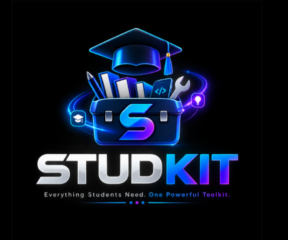

# STUDKIT 🚀
### *Your Everyday Digital Toolkit*



> **STUDKIT** is a fast, modern, and private digital toolkit designed for **students, professionals, freelancers, office workers, and everyday users**. It brings together essential utilities for documents, images, calculations, academic planning, career tools, and daily productivity into one unified, offline-capable web application.

---

## 🌟 Overview: What is STUDKIT?

**STUDKIT** eliminates the need for bookmarking dozens of separate ad-heavy single-purpose websites. Everything in STUDKIT runs **100% client-side** directly in your browser — meaning your data, documents, and inputs stay completely private on your device.

- 🔒 **100% Client-Side Privacy**: Files and personal inputs are processed locally in browser memory without external server transmissions.
- ⚡ **Instant Performance**: Built with React, TypeScript, and Vite for ultra-fast response times.
- 🎨 **Futuristic & Clean UI**: Cyberpunk-inspired aesthetic, customizable themes (Midnight, Ocean, Crimson, Graphite, Purple, Minimal Light), and smooth micro-interactions.
- 📱 **Mobile & Desktop Responsive**: Fully optimized across desktop workstations, laptops, tablets, and mobile devices.
- ♿ **Accessible Motion**: Hardware-accelerated CSS animations with full respect for `prefers-reduced-motion`.

---

## 👥 Who is STUDKIT For?

- **🎓 Students**: Manage semester GPAs, track assignment writing quotas, format research citations (APA/MLA), prepare for oral vivas, and schedule study revision blocks.
- **💼 Professionals & Office Workers**: Calculate salary breakdowns, analyze purchase affordability, generate standard vCards (.VCF) with QR codes, and generate business correspondence.
- **💻 Developers & Tech Enthusiasts**: Base64 encoders/decoders, JSON formatters, regex testers, color palette generators, and markdown previews.
- **✨ Everyday Users**: Convert image formats, compress images to exact file sizes (KB/MB), manage monthly budgets, spin decision wheels, and draft ready-to-send messages.

---

## 🗂️ Main Tool Suites & Categories

```
STUDKIT WORKSPACE ARCHITECTURE
├── 📄 1. Documentation & PDF Suite
├── 🖼️ 2. Image Processing Studio
├── 🔢 3. Calculators & Mathematical Engines
├── ⏱️ 4. Everyday Productivity & Planning
├── 💼 5. Career & Professional Utilities
├── 🛠️ 6. Developer & Code Tools
├── 🧠 7. Mind Lab & Study Focus
└── 🎮 8. Relax, Fun & Games
```

---

## ⭐ Featured & Highlighted Tools

STUDKIT includes over a hundred specialized utilities. Here is a spotlight on some of the most popular tools:

### 🔲 QR Code Generator Studio
- Generate high-resolution customized QR codes for URLs, text, Wi-Fi credentials, vCards, and emails.
- Customize foreground/background colors and download high-quality PNG images instantly.

### 🎓 Grade & GPA / CGPA Calculator
- Multi-scale support: **4.0 Scale** (US/Intl), **5.0 Scale**, **10.0 Scale** (CBSE/AICTE), and **Percentage Scale**.
- Features semester SGPA, cumulative CGPA projection, quality points tracking, academic honors classification (*Summa Cum Laude*, *Dean's List*), and 1-click CSV report export.

### 📄 Word ⟷ PDF & Document Studio
- Convert Word documents (`.docx` / `.doc`) to PDF and extract clean document text.
- Client-side PDF page merging, splitting, and rotation.

### 🖼️ Exact KB/MB Image Compressor & Passport Photo Maker
- Compress images to exact target thresholds (e.g., 50 KB, 100 KB, 200 KB) required for exam registrations and portals.
- Create official passport and exam ID photos with printable 4x6 / A4 sheet layouts.

### 📇 Digital Contact Card (.VCF) Generator
- Create professional contact cards with live interactive previews across 4 themes.
- Generates standard **vCard 3.0 (`.vcf`)** files compatible with Apple iOS, Android, and Outlook, alongside a scannable contact QR code.

### 💸 "Can I Afford This?" & Salary Breakdown Calculator
- **Can I Afford This?**: Evaluate upfront and installment purchase impacts against monthly income, expenses, and savings targets.
- **Salary Breakdown**: Convert annual, monthly, or weekly salaries into gross and net daily and hourly take-home earnings with customizable deductions.

### 💬 Automatic Message Generator
- 100% non-AI, template-driven message generator across 16 categories (*Birthday, Apology, Payment Reminder, Meeting, Exam, Congratulations, etc.*) with 4 communication tones and 1-click WhatsApp click-to-chat pre-fill.

---

## 🛠️ Technology Stack

STUDKIT is built with modern, lightweight, and robust web standards:

| Layer | Technology |
| :--- | :--- |
| **Frontend Framework** | [React 18](https://react.dev/) (Functional Components & Hooks) |
| **Language** | [TypeScript 5](https://www.typescriptlang.org/) (Strict Type Safety) |
| **Build Tool & Bundler** | [Vite 6](https://vitejs.dev/) (Hot Module Replacement) |
| **Styling & Design** | [Tailwind CSS 3](https://tailwindcss.com/) with Custom CSS Variables & Themes |
| **Icons & Visuals** | [Lucide React](https://lucide.dev/) |
| **Document Processing** | [pdf-lib](https://pdf-lib.js.org/) & [JSZip](https://stuk.github.io/jszip/) |
| **Matrix & QR Engine** | [qrcode](https://github.com/soldair/node-qrcode) |
| **Audio Synthesis** | Native Web Audio API (Timers, Soundscapes & Chimes) |

---

## 📁 Project Structure

```
StudKit/
├── public/
│   └── assets/
│       ├── studkit-logo.png          # Brand logo
│       └── studkit-intro.mp4         # Cinematic intro media
├── src/
│   ├── components/
│   │   ├── blog/                     # Blog & knowledge base articles
│   │   ├── common/                   # Reusable UI cards, backgrounds & modals
│   │   ├── intro/                    # Startup sequences & brand splash
│   │   ├── layout/                   # Navbar, sidebar, category grids & footer
│   │   ├── onboarding/               # First-time user tour guide
│   │   └── tools/                    # Tool components by category
│   │       ├── calculators/          # GPA, budget, salary, physics, finance
│   │       ├── career/               # Resume, cover letter, interview tools
│   │       ├── daily/                # Quotes, lifestyle, daily planners
│   │       ├── developer/            # Base64, JSON, regex, color palette
│   │       ├── games/                # Focus games, reflex tests, relax tools
│   │       ├── image/                # Image compressor, resizer, passport photo
│   │       ├── media/                # Video compressor & lightweight editor
│   │       ├── mind/                 # Breathing, binaural audio, ambient sounds
│   │       ├── pdf/                  # PDF merger, splitter, Word converter
│   │       └── productivity/         # Timers, contact cards, message generator
│   ├── data/
│   │   ├── blogPosts.ts              # Knowledge base articles
│   │   ├── themePresets.ts           # Theme definitions
│   │   └── toolsRegistry.ts          # Central tool registry metadata & tags
│   ├── types/
│   │   └── index.ts                  # Shared TypeScript interfaces
│   ├── utils/
│   │   ├── audio.ts                  # Web Audio synthesizer
│   │   ├── download.ts               # Client-side file exporter
│   │   ├── searchEngine.ts           # Real-time search & intent engine
│   │   └── storage.ts                # LocalStorage state manager
│   ├── App.tsx                       # Main application router & tool dispatcher
│   ├── index.css                     # Global design system & animation tokens
│   └── main.tsx                      # React root entry point
├── index.html                        # Application entry HTML
├── package.json                      # Project metadata & dependencies
├── tailwind.config.js                # Tailwind theme customization
├── tsconfig.json                     # TypeScript configuration
└── vite.config.ts                    # Vite build configuration
```

---

## 🚀 Getting Started & Local Installation

### Prerequisites
- [Node.js](https://nodejs.org/) (Version 18 or higher recommended)
- [npm](https://www.npmjs.com/) (bundled with Node.js)

### Installation Steps

1. **Clone or Download the Repository**:
   ```bash
   git clone https://github.com/your-username/studkit.git
   cd studkit
   ```

2. **Install Dependencies**:
   ```bash
   npm install
   ```

3. **Start the Local Development Server**:
   ```bash
   npm run dev
   ```
   Open your browser and navigate to `http://localhost:5173`.

4. **Build for Production**:
   ```bash
   npm run build
   ```
   The compiled, minified production assets will be generated in the `dist/` directory.

5. **Preview Production Build Locally**:
   ```bash
   npm run preview
   ```

---

## 📌 Project Status & Active Improvement

STUDKIT is under active development. Current focus areas include:
- Expanding client-side document conversion capabilities.
- Refining mobile touch ergonomics and micro-interactions.
- Adding additional non-AI academic reference tools and engineering calculators.
- Continually optimizing load times and memory footprints.

---

## 💡 Feedback & Contributions

Suggestions, feedback, and issue reports are warmly welcomed!

- **Found a bug or have a feature idea?** Feel free to open an issue or submit a pull request on GitHub.
- **Explore more. Try more. Share your feedback.**

---

## 👨‍💻 Creator & Credits

Designed, engineered, and maintained by:

**Made by Sohaib Shahid**